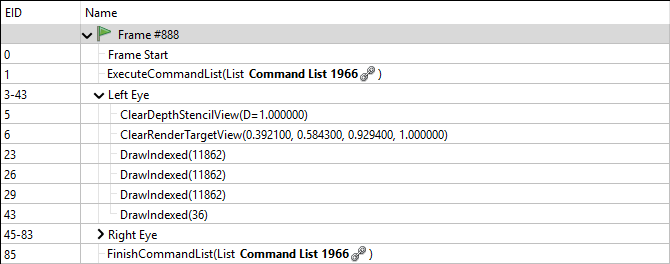

# Veldrid 4.5.0

_2018-12-15_

Veldrid 4.5.0 is now available for download. This is the largest release to date, and includes many exciting new features. A big thanks to everyone who has contributed to this release!

## Virtual Reality Support

A new add-on library, Veldrid.VirtualReality, provides the ability to render into VR headsets with a simple, portable API. Both OpenVR and Oculus are supported, and VR setup can be accomplished in just a few lines of code. All Veldrid backends are supported. Once a `VRContext` is created, rendering is performed as normal into a `Framebuffer` object for each eye, which are automatically created and managed by Veldrid. The library also includes support for updating and retrieving the HMD's current pose.


## Improved SPIR-V Support

[Veldrid.SPIRV](https://mellinoe.github.io/graphics/2018/06/25/veldrid-spirv.html) now supports all desktop and mobile platforms, including iOS and Android. On Android, both arm64-v8a and armeabi-v7a ABIs are supported. The [latest NuGet package](https://www.nuget.org/packages/veldrid.spirv) includes build-time support which automatically bundles all required native components with your application.

## sRGB Textures

Several sRGB pixel formats are now supported. In addition, it is possible to create a Swapchain which is backed by an sRGB-encoded Texture. When rendering to a Framebuffer backed by an sRGB Texture, automatic conversion from linear to sRGB space will be done. When sampling from a sRGB-encoded Texture, the reverse transformation (sRGB to linear) will occur automatically.

See the new SRgb-suffixed members in [PixelFormat](xref:Veldrid.PixelFormat) for the full set of supported sRGB formats.

## CommandList Debug Groups

Several utility methods have been added to CommandList which allow nested "debug groups" to be pushed and popped into the command stream, and for individual debug markers to be inserted.

* [void CommandList.PushDebugGroup(string name)](xref:Veldrid.CommandList#Veldrid_CommandList_PushDebugGroup_System_String_)
* [void CommandList.PopDebugGroup()](xref:Veldrid.CommandList#Veldrid_CommandList_PopDebugGroup)
* [void CommandList.InsertDebugMarker(string name)](xref:Veldrid.CommandList#Veldrid_CommandList_InsertDebugMarker_System_String_)

These groups and markers can be visualized in graphics debuggers like RenderDoc, which helps distinguish different portions of a frame capture.

```C#
commandList.PushDebugGroup("Left Eye");
RenderEye(VREye.Left);
commandList.PopDebugGroup();

commandList.PushDebugGroup("Right Eye");
RenderEye(VREye.Right);
commandList.PopDebugGroup();
```



_Shown above: a [RenderDoc](https://renderdoc.org/) frame capture, with collapsible sections for each debug group._

## Native Backend Access

In order to integrate with Virtual Reality SDKs, limited support for retrieving backend-specific information has been added. These new features should be used sparingly when no fully-portable option is available. See the following new types for more information:

* [Veldrid.BackendInfoVulkan](xref:Veldrid.BackendInfoVulkan)
* [Veldrid.BackendInfoD3D11](xref:Veldrid.BackendInfoD3D11)
* [Veldrid.BackendInfoOpenGL](xref:Veldrid.BackendInfoOpenGL)

## DeviceBufferRange and dynamic buffer resources

[DeviceBufferRange](xref:Veldrid.DeviceBufferRange) is a new [BindableResource](xref:Veldrid.BindableResource) type which allows a portion of a [DeviceBuffer](xref:Veldrid.DeviceBuffer) to be made available to a shader, rather than its full range.

Support for "dynamic" buffer resources has also been added. This feature allows you to choose a dynamic offset for a DeviceBuffer or DeviceBufferRange when it is bound to a [CommandList](xref:Veldrid.CommandList). This allows you to store multiple distinct ranges of data without needing to manage multiple DeviceBuffers.

* See the documentation for [DeviceBufferRange](xref:Veldrid.DeviceBufferRange) and [ResourceLayoutElementOptions.DynamicBinding](xref:Veldrid.ResourceLayoutElementOptions) for more information on these features.

## Source Link

[Source Link](https://docs.microsoft.com/en-us/dotnet/standard/library-guidance/sourcelink) has been enabled in the NuGet packages. It is now possible to step through Veldrid sources using Visual Studio or any other debugger supporing Source Link.

## Miscellaneous Additions

* Added ImageSharpCubemapTexture, a helper class for creating cubemap Textures using ImageSharp. [@geoeo](https://github.com/geoeo)
* Support for 16-bit float vertex formats.
  * [VertexElementFormat.Half1](xref:Veldrid.VertexElementFormat), [VertexElementFormat.Half2](xref:Veldrid.VertexElementFormat), [VertexElementFormat.Half4](xref:Veldrid.VertexElementFormat)
* [Texture](xref:Veldrid.Texture) now implements the [BindableResource](xref:Veldrid.BindableResource) interface, meaning it can be included directly into a [ResourceSet](xref:Veldrid.ResourceSet) without the need to create a [TextureView](xref:Veldrid.TextureView). Doing this is functionally equivalent to binding a TextureView that covers the full range of mip levels and array layers in the Texture.
* [TextureViewDescription](xref:Veldrid.TextureViewDescription) now includes a [PixelFormat Format](xref:Veldrid.TextureViewDescription#Veldrid_TextureViewDescription_Format) field, which can be used to control how the pixel data is interpreted through the [TextureView](xref:Veldrid.TextureView). The format of a TextureView is allowed to be:
  * The same [PixelFormat](xref:Veldrid.PixelFormat) as its [Target Texture](xref:Veldrid.TextureViewDescription#Veldrid_TextureViewDescription_Target).
  * The matching sRGB or non-sRGB counterpart to its Target Texture.
  * For uncompressed Textures, a different PixelFormat with the same data size and number of components.
* Add Sdl2Window.Resizable and Sdl2Window.BorderVisible. Expose SDL_WINDOWPOS_CENTERED, SDL_GetClipboardText, and SDL_SetClipboardText.
* Better support for deploying the SDL2 native binary to mono projects when using Veldrid.SDL2.
* Allow creating a Metal Swapchain for an NSView directly. This allows you to embed a Veldrid view (or multiple views) into standard macOS UI applications. See [SwapchainSource.CreateNSView(IntPtr)](xref:Veldrid.SwapchainSource#Veldrid_SwapchainSource_CreateNSView_System_IntPtr_).

## All Changes

* [OpenGL] Improve compatibility in "roundabout" texture copy code path. [[507bade]](https://github.com/mellinoe/veldrid/commit/507bade760f42ae63fb5785459c32c803ecb64bb)
* [OpenGLES] Replace usage of glGetTexImage with glReadPixels. [[fc865ce]](https://github.com/mellinoe/veldrid/commit/fc865cec7d17f5e4203c49772c6884b1ede169a3)
* Only create GraphicsDevice.Aniso4xSampler if supported. [[7f18acf]](https://github.com/mellinoe/veldrid/commit/7f18acfea88970f0375fd3a636928adfcff6d4a8)
* Fix D3D11CommandList.GenerateMipmaps on non-sampled/storage textures. [[6bdcf6d]](https://github.com/mellinoe/veldrid/commit/6bdcf6de1c9112ae577ad2f2fca59c6c0393e545)
* Add support for rendering into Virtual Reality headsets. [[ca9a963]](https://github.com/mellinoe/veldrid/commit/ca9a963100702004f20c3e0a293287dc46bc9e40)
* [Vulkan] Fix a potential thread timing issue related to Vulkan command buffer tracking. [[2c0c4e8]](https://github.com/mellinoe/veldrid/commit/2c0c4e8a61af2ac55a1e3dd9a99862031ba7dc31)
* [Vulkan] Enable shaderStorageImageMultisample if available. [[0d37210]](https://github.com/mellinoe/veldrid/commit/0d3721088059e4217e561fc41cba9dabec39ebcf)
* [SDL2] Do not throw a TypeInitializationException if some SDL2 functions cannot be loaded. [[0ceea20]](https://github.com/mellinoe/veldrid/commit/0ceea20b2492107a376ed7fdc87e2be20ee7eff9)
* [OpenGL] Set Thread.IsBackground to true for the OpenGL execution thread. [[2df19ea]](https://github.com/mellinoe/veldrid/commit/2df19eaa2ff50a05e9d9ac8f7057e1a7f9c9fd77)
* [SDL2] Add Sdl2Window.Resizable and .BorderVisible. [[90896fb]](https://github.com/mellinoe/veldrid/commit/90896fbd6d7ffcc1e28d80ffa008e1ac776dac50)
* [SDL2] Add an MSBuild config file for mono targets. [[75af565]](https://github.com/mellinoe/veldrid/commit/75af565e2375fe59aa5afd1cede28a55e5708ff4)
* [Metal] Add support for creating a Metal Swapchain from an NSView. [[e170e90]](https://github.com/mellinoe/veldrid/commit/e170e90cb808229551fd78a9d87ee788c0de6662)
* Implement BindableResource on Texture directly. [[044d542]](https://github.com/mellinoe/veldrid/commit/044d542b2b9968ca853cb054bebdbc6c78775805)
* Allow TextureViews to use a different PixelFormat from their target. [[080ed1c]](https://github.com/mellinoe/veldrid/commit/080ed1cc64fe4588a94b671a2b0e48c273d83f53)
* Fix typo that prevented creating a TextureView for anything other than the first array layer in a Texture2D [[274e443]](https://github.com/mellinoe/veldrid/commit/274e443ba926e638e54e968c1db7daffe2bdc90c) ([@tgjones](https://github.com/tgjones))
* Allow non-multiple-of-four-sized texture to be updated with multiple-of-four mipmap data [[64b79bd]](https://github.com/mellinoe/veldrid/commit/64b79bd8987811182f48330594b44dfa2663bb98) ([@tgjones](https://github.com/tgjones))
* [OpenGL] Detect GLES 3.2 support for GL_OES_draw_elements_base_vertex. [[d1e1cac]](https://github.com/mellinoe/veldrid/commit/d1e1caca468bf2d9be72f54dfcd941789fc41ae1)
* Add additional compressed sRGB formats. [[9efcc8a]](https://github.com/mellinoe/veldrid/commit/9efcc8afbb99da761b35ea7c5477be4d1c137712)
* [D3D11] Disable alt-enter fullscreen behavior in Win32. [[700d2de]](https://github.com/mellinoe/veldrid/commit/700d2dedbf3432142bfbc7cd67718cbffafe3c9e)
* [Metal] Hook into MTLCommandBuffer's completion callback using Objective C blocks. [[1995973]](https://github.com/mellinoe/veldrid/commit/1995973f282f22b27fc59615a99d81184142ec6f)
* Add additional texture layout transitions in VkCommandList.cs. [[c8a12cb]](https://github.com/mellinoe/veldrid/commit/c8a12cb8930115188f632793976dd6bba61f2689)
* [OpenGL] Fix an error in SSBO index calculation. [[768ea32]](https://github.com/mellinoe/veldrid/commit/768ea32384ff4d7b8b9c42e90b6281b09fe0b602)
* Add XML docs for new dynamic buffer overloads on CommandList, and add array overloads. [[c705ef6]](https://github.com/mellinoe/veldrid/commit/c705ef65b49ea171a3ec13f828504aa968a31d77)
* Add back some validation for dynamic buffers, and fix Vulkan descriptor allocation. [[355dd27]](https://github.com/mellinoe/veldrid/commit/355dd278913de11909784a147c45a99f2c4ad842)
* Allow buffers to have a dynamic offset when bound to a CommandList. [[3e89496]](https://github.com/mellinoe/veldrid/commit/3e8949663df5d59d42e6aa0b1a970220e97fc3b4)
* Allow uniform buffers to be bound with an offset+size. [[33a0545]](https://github.com/mellinoe/veldrid/commit/33a054555ac3148576413d4919b0728bdd9d9a93)
* [ImGui] Remove unnecessary allocation in ImGuiRenderer.cs. [[3540206]](https://github.com/mellinoe/veldrid/commit/3540206320090bfba0239db813bcfda5e3cb97df)
* Add three debug utility methods to CommandList. [[8145d9f]](https://github.com/mellinoe/veldrid/commit/8145d9f0e8bd48f296282758a370d77c05ddaaf5)
* UIView Swapchains now scale with the screen's "nativeScale" property. [[14461b0]](https://github.com/mellinoe/veldrid/commit/14461b007cc9061d786823fbd60d22f3aefa7df6)
* [OpenGL] Ensure that SwapchainDescription values override GraphicsDeviceOption ones. [[fc7cf9e]](https://github.com/mellinoe/veldrid/commit/fc7cf9ef835e63e2d46ac71a014aa7dcd0b449b9)
* [Metal] Fix a couple of issues with texture copies with non-zero origins. [[74e25c8]](https://github.com/mellinoe/veldrid/commit/74e25c87354632a7d027cfd83c367c1ad1235559)
* [OpenGL] Fix some unimplemented code paths involving compressed array texture copies and mapping. [[36772e1]](https://github.com/mellinoe/veldrid/commit/36772e19950cdc7f0f283174c638195dfcfb394d)
* [Vulkan] Fix some logic related to regular->staging texture copies with non-zero copy origins. [[147c0fb]](https://github.com/mellinoe/veldrid/commit/147c0fbe29592bf9b751c1acca7a27738e49bdc0)
* Add support for sRGB PixelFormats.
  * Refactor some things about sRGB a little bit to better support legacy OpenGL behavior. [[5ba6c72]](https://github.com/mellinoe/veldrid/commit/5ba6c7242e52e633ca3aae60423a9d39fe289cbf)
  * Add stream constructor to ImageSharpTexture (#130) [[b137344]](https://github.com/mellinoe/veldrid/commit/b13734472e46ae7ad0ab2fd65cb70fe3f70e418b) ([@feliwir](https://github.com/feliwir))
  * Recompile imgui-vertex.metal. [[5b5adba]](https://github.com/mellinoe/veldrid/commit/5b5adbaab86030f3ef54b68ef31f794e76a15391)
  * [ImGui] Make sure alpha channel is transferred over in new sRGB-aware ImGui shaders. [[485a1d2]](https://github.com/mellinoe/veldrid/commit/485a1d26d56f497c820956f7e80203d0fa2f7a74)
  * [ImGui] Ensure that brief mouse presses are captured. [[2569246]](https://github.com/mellinoe/veldrid/commit/25692463cafa5820904701144518c8a2e2dea4de)
  * [Metal] Support SyncToVerticalBlank on macOS 10.13+. [[31cd6bc]](https://github.com/mellinoe/veldrid/commit/31cd6bc3af2462eaeae7af82e3627dcc5861509b)
  * [OpenGL] On macOS, always consider the backbuffer sRGB. [[8b0a73c]](https://github.com/mellinoe/veldrid/commit/8b0a73ceed8fceef68ba6409ec10e8ebbb1ad0a1)
  * [Metal] Compile new ImGui Metal shader. [[9b611a1]](https://github.com/mellinoe/veldrid/commit/9b611a159ebfd62ffa547e8f30817358fe1629ab)
  * [Demo] Output linear pixels in the demo's UI renderer. [[df79cc8]](https://github.com/mellinoe/veldrid/commit/df79cc8e00dbdc8a17e5331387550d9ab885c1f6)
  * [ImGui] Allow ImGuiRenderer to output both linear and sRGB pixel data. [[13a1a89]](https://github.com/mellinoe/veldrid/commit/13a1a8957bcf9ea3fd4d0f492a6361685c42eccb)
  * [ImageSharp] Add an option to ImageSharpTexture to treat images as sRGB. [[c425edf]](https://github.com/mellinoe/veldrid/commit/c425edfa8a0b45b36bec652992afb494e52b5368)
  * Add support for VertexElementFormat.Half1/2/4. [[5880aef]](https://github.com/mellinoe/veldrid/commit/5880aef7997321425386a270fdaac1f4dbf419ac)
  * [Demo] Fix how shader sets were being cached with respect to different SpecializationConstants. [[65ee9b4]](https://github.com/mellinoe/veldrid/commit/65ee9b4a006258ab8379f9b1a15c5021e21907bb)
  * [Demo] Allow switching back and forth between sRGB swapchain format. [[c75b1a3]](https://github.com/mellinoe/veldrid/commit/c75b1a352e1a377fbf94444a58c0fbe4ba0ae24d)
  * [OpenGL] Explicitly set the SDL attribute for sRGB to false unless it is enabled. [[0f75141]](https://github.com/mellinoe/veldrid/commit/0f751416152cdbdc5aec5ae398ecca6e0bd1edee)
  * [Demo] Additional demo changes to accomodate sRGB. [[698a2dd]](https://github.com/mellinoe/veldrid/commit/698a2dd06ccccfc408f8130bf890b680cef6b7a3)
  * [OpenGL] Do a roundabout query process for determining whether the backbuffer is sRGB. [[15e4764]](https://github.com/mellinoe/veldrid/commit/15e4764811678a80bfa32ec6b4a07533149ac669)
  * Implement sRGB support on Metal. [[c0363dd]](https://github.com/mellinoe/veldrid/commit/c0363ddb8ae6e7a64129fb86a5a6a7652efe4324)
  * More sRGB work. [[ccccb4e]](https://github.com/mellinoe/veldrid/commit/ccccb4e789b4b586a75196f998fcd9c12c4192b3)
  * Add sRGB PixelFormat support. [[c2a433e]](https://github.com/mellinoe/veldrid/commit/c2a433e2404ce48bca86d3ec24452d32182ea1ce)
* [D3D11] Fix an issue with how vertex bindings were flushed in some cases. [[7f8f9a9]](https://github.com/mellinoe/veldrid/commit/7f8f9a967c7524af36eb2b6a32b5e1feae1a96bd)
* Expose VeldridStartup.SetSDLGLContextAttributes. [[df2f131]](https://github.com/mellinoe/veldrid/commit/df2f1313885e30cac0be776699b2576d0f6bbc19) ([AridTag](https://github.com/AridTag))
* [SDL2] Add SDL_Get/SetClipboardText. [[28c91f0]](https://github.com/mellinoe/veldrid/commit/28c91f04db043ef5acf3da66f28a97095ed2750c)
* [Vulkan] Re-acquire swapchain after recreating it due to vsync change. [[b082a87]](https://github.com/mellinoe/veldrid/commit/b082a87d126b66ad7587b99b405262172e5dc86c)
* [Vulkan] Add the submission fence to the list after call to vkQueueSubmit. [[ccea463]](https://github.com/mellinoe/veldrid/commit/ccea463ffd02f8d845aa76bb49486ba15cc562cc)
* [Vulkan] Use a ConcurrentQueue for reusable VkFence collection. [[391738b]](https://github.com/mellinoe/veldrid/commit/391738b3698c4f79914d985b1aad5b3a219d3d58)
* Give Veldrid.ImGui its own independent version.json file. Bump it to 5.0.65. [[cf43ced]](https://github.com/mellinoe/veldrid/commit/cf43cedec003df213c4696589d012adab20ea813)
* Update Veldrid.ImGui to latest autogen'd ImGui.NET package. [[fac9317]](https://github.com/mellinoe/veldrid/commit/fac9317ffe2605f6c7b09cabc30f32fb2dac7311)
* Expose Sdl2Native.SDL_WINDOWPOS_CENTERED. [[a9df038]](https://github.com/mellinoe/veldrid/commit/a9df038927e10b6597d770b9781fb0517370014d)
* [Vulkan] Sort freed memory blocks and combine contiguous blocks. [[59b3a30]](https://github.com/mellinoe/veldrid/commit/59b3a3034f4ff29dc329c2986cf8cc02676c2efe)
* [Vulkan] Fix an issue with how the "new ResourceSet count" variables were tracked. [[7f0aa5b]](https://github.com/mellinoe/veldrid/commit/7f0aa5b1c307d648cf7fda93a813610571787a63)
* [Vulkan] Insert a memory barrier after calling vkCmdCopyBuffer. [[1acc3e3]](https://github.com/mellinoe/veldrid/commit/1acc3e3bdc8b5593548ea8592139272e39d59826)
* [Vulkan] Allow allocations larger than 256 MB (64 MB dynamic). [[1edc419]](https://github.com/mellinoe/veldrid/commit/1edc419eccb7324420da203b5b466f8995220c91)
* [Vulkan] Vulak is only supported when at least one VkPhysicalDevice exists. [[bfae1ac]](https://github.com/mellinoe/veldrid/commit/bfae1ac81fb38826da980fe49d84ab45ef20e28b)
* [Vulkan] Fix some ordering issues with how fences and staging resources were tracked. [[54f578a]](https://github.com/mellinoe/veldrid/commit/54f578ae2bf3973ff55bf2c1006775203d1fc8f0)
* [Vulkan] Fix handling of swapchain resize when window is minimized. [[7e3142f]](https://github.com/mellinoe/veldrid/commit/7e3142f82b62d1ce3641d89417102ba57fe67e55)
* [D3D11] Instead of relying on D3D11.1, use the officially-prescribed UpdateSubresource workaround in D3D11CommandList.UpdateBuffer. [[12da221]](https://github.com/mellinoe/veldrid/commit/12da221dfd4acb12df507708a4c2f9f304b4cfcb)
* [ImageSharp] Use CreateTextureViaUpdate instead of CreateTextureViaStaging. [[e8e6084]](https://github.com/mellinoe/veldrid/commit/e8e6084ca875b0f7608cfbdb5a5b1397eb171965)
* [OpenGL] Stop tracking CommandLists when their reference count reaches 0. [[2fa3700]](https://github.com/mellinoe/veldrid/commit/2fa370090c006bbde9b9534223f2fcfec489bcb5)
* Change all backends to skip CommandList.UpdateBuffer if the size is 0. [[fd28642]](https://github.com/mellinoe/veldrid/commit/fd28642ae084b808b119b5c9d32af0a4b7d4f8b0)
* [Metal] Fix CommandList.CopyTexture for small compressed texture regions. [[516b269]](https://github.com/mellinoe/veldrid/commit/516b269524647caadc5252cda9379e0c8c31c5db)
* [Metal] Fix CommandList.UpdateTexture with 0 size. [[b573b76]](https://github.com/mellinoe/veldrid/commit/b573b767ba185bc683403b824244de4b30d08156)
* Fix CommandList.CopyBuffer with a copy size of 0 bytes. [[182651a]](https://github.com/mellinoe/veldrid/commit/182651a5806217ca7098ef4b1a41d585d9df2640)
* Fix swapped doc comments for BlendFactor.One and Zero. [[a7c6382]](https://github.com/mellinoe/veldrid/commit/a7c6382697aeddec1d0ca359c033c87e50379c86)
* Skybox.cs: Used new cubemap texture class to remove unsafe code (#115) [[6205e88]](https://github.com/mellinoe/veldrid/commit/6205e883eb9d4032fb3af36aac59eef563a9e73d) [@geoeo](https://github.com/geoeo)
* Free the GCHandle used in UpdateTexture(T[]). [[171a33a]](https://github.com/mellinoe/veldrid/commit/171a33ad236e2bfaa8c4f0725c04167229c77932)
* On macOS, return false for IsBackendSupported(GraphicsBackend.OpenGLES). [[46ce154]](https://github.com/mellinoe/veldrid/commit/46ce154a0ebdded4fccee7ff93dec4c31352b5d8)
* [Metal] Track support for individual sample count values. [[8c1a90a]](https://github.com/mellinoe/veldrid/commit/8c1a90a0c9e8be580ada4bd788aa039cba1c42a8)
* [Vulkan] Fix some edge case issues around how Vulkan Framebuffer state is tracked. [[9f2772c]](https://github.com/mellinoe/veldrid/commit/9f2772c8aec278ae7532c82b9b3c309047519d08)
* Update to ImageSharp beta5 and remove obsolete methods [[fac61cd]](https://github.com/mellinoe/veldrid/commit/fac61cdf2913df5b3d8d308f3fe6bd17c02f5535) ([JimBobSquarePants](https://github.com/JimBobSquarePants))
