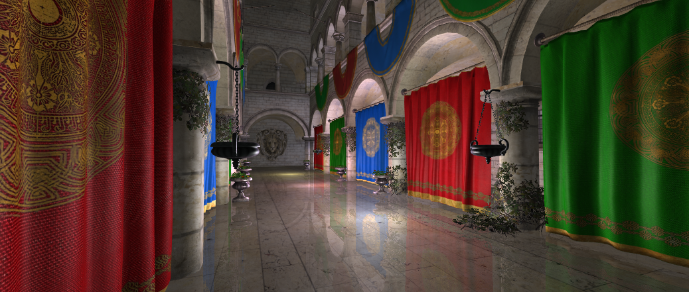

# Veldrid Beta 1

_2017-12-14_

Today I'm announcing the first beta version of Veldrid, an open source 3D graphics library for .NET. It is available on [NuGet](https://www.nuget.org/packages/Veldrid/), and the source on [GitHub](https://github.com/mellinoe/veldrid).

## What is it?

Veldrid is a low-level graphics library. It can be used to create high-performance, cross-platform 2D and 3D games, simulations, tools, and other graphical applications. Unlike most other .NET graphics libraries, Veldrid is designed to be portable, meaning it is not tied to any particular operating system or native graphics API. With Direct3D, Vulkan, and OpenGL backends, applications built with Veldrid can run on all desktop and mobile platforms without modification. Other than the bindings for the native graphics APIs it uses, Veldrid is completely dependency-less. It is built as a .NET Standard 2.0 library, so it can be easily integrated into any .NET project.

Check out the [Veldrid Introduction](xref:intro) article for an overview of the library's features.

## License

Veldrid is available under the permissive [MIT license](https://github.com/mellinoe/veldrid/blob/master/LICENSE), and is free to use and modify. Contributions are welcome on GitHub.

## Extras

In addition to the core Veldrid package, there are also several optional utility packages available, which offer easy integration with some popular libraries.

* __[Veldrid.ImGui](https://www.nuget.org/packages/Veldrid.ImGui/)__: Simple Veldrid integration for [ImGui.NET](https://github.com/mellinoe/imgui.net).
* __[Veldrid.ImageSharp](https://www.nuget.org/packages/Veldrid.ImageSharp/)__: Loads Veldrid Textures using [ImageSharp](https://sixlabors.com/projects/imagesharp/).
* __[Veldrid.StartupUtilities](https://www.nuget.org/packages/Veldrid.StartupUtilities/)__: Streamlined window and input management using [SDL2](https://www.libsdl.org/).

## Getting Started

There is a [short walkthrough article](xref:getting-started-intro) demonstrating the basic features of Veldrid.

## Samples

The [Veldrid Samples](https://github.com/mellinoe/veldrid-samples) repository includes a number of sample applications, demonstrating some of the rendering techniques possible using Veldrid.